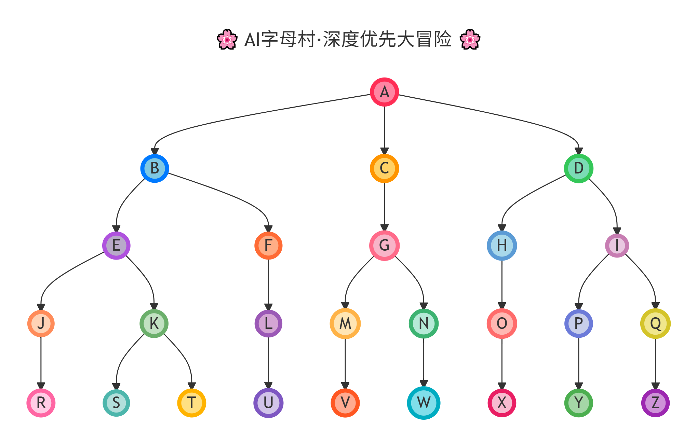

# 深度优先遍历遇上 AI：用 LangChain Agent 实现 26 个字母的趣味自我介绍



## 📖 前言

作为一名算法爱好者，我一直在学习经典的数据结构和算法。最近，我尝试将**深度优先搜索(DFS)**与**LangChain Agent** 结合，创造了一个有趣的项目：让 26 个英文字母通过图的遍历进行个性化的 AI 自我介绍。

这是我第一次使用 LangChain Agent，整个过程既充满挑战又非常有趣。本文将分享我的实现思路、技术要点以及心得体会。

---

## 🎯 项目目标

1. **构建一个有向图**：包含 26 个节点（A-Z），体现 DFS 的树状分支特性
2. **实现深度优先遍历**：从 A 出发，按照 DFS 规则遍历所有节点
3. **集成 AI 代理**：每个节点被访问时，调用 LangChain Agent 生成个性化自我介绍
4. **展示非顺序遍历**：避免简单的 A→B→C 顺序，体现 DFS "深入到底，然后回溯" 的特点

---

## 🏗️ 核心技术栈

- **Python 3.13+**
- **LangChain**：用于创建 AI Agent
- **DeepSeek API**：提供大语言模型服务
- **图数据结构**：邻接表表示法
- **迭代式 DFS**：使用栈实现非递归遍历

---

## 📊 图结构设计

### 设计原则

为了让 DFS 的特性更加明显，我设计了以下规则：

1. **树状分支结构**：从根节点 A 出发，形成多个分支
2. **向前连接**：只能从字母表中靠前的字母指向靠后的字母（不会出现回连）
3. **跨度限制**：每条边的跨度不超过 3（如 A→D 合法，A→E 不合法）
4. **连通性保证**：从 A 出发必须能够到达所有节点，包括 Z

### 邻接表表示

```
A -> B, C, D
B -> E, F
C -> G
D -> H, I
E -> J, K
F -> L
G -> M, N
H -> O
I -> P, Q
J -> R
K -> S, T
L -> U
M -> V
N -> W
O -> X
P -> Y
Q -> Z
R ~ Z -> (无出边，叶子节点)
```

### 为什么这样设计？

这种树状结构能够很好地展示 DFS 的遍历特点：

- **深入优先**：DFS 会先沿着一条路径走到底，例如 `A → D → I → Q → Z`
- **回溯机制**：到达叶子节点后，回溯到上一个节点，探索其他分支
- **非顺序性**：不会简单地按 ABCD...Z 的顺序访问，而是根据图的结构动态决定

---

## 🔍 深度优先搜索（DFS）实现

### 算法选择：迭代 vs 递归

我选择了**迭代方式**实现 DFS，主要原因：

1. **避免递归深度限制**：Python 默认递归深度有限制
2. **更直观的控制**：可以清晰地看到栈的操作过程
3. **性能更好**：避免了函数调用的开销

### 核心代码逻辑

```python
def _dfs(self, start_node: str):
    """使用迭代方式执行深度优先遍历，并调用每个节点的函数"""
    visited = set()
    stack = [start_node]
    while stack:
        node = stack.pop()
        if node in visited:
            continue
        visited.add(node)
        self.nodes[node]()  # 执行节点关联的函数
        # 逆序添加邻居节点，保证从左到右的遍历顺序
        stack.extend(reversed(self.edges.get(node, [])))
```

### 关键细节

1. **visited 集合**：记录已访问的节点，避免重复访问
2. **栈的使用**：利用栈的 LIFO 特性实现深度优先
3. **逆序添加**：为了保证从左到右的遍历顺序，需要逆序添加邻居节点
4. **守卫子句**：使用 `continue` 提前跳过已访问节点，减少嵌套

---

## 🤖 LangChain Agent 集成

### 为什么使用 Agent？

传统的图遍历只是访问节点，而我希望每个节点被访问时能够：

- 生成个性化的内容
- 展现 AI 的创造力
- 让算法演示更有趣味性

### Agent 配置

#### 系统提示词设计

```python
SYSTEM_PROMPT = """
【角色】用户所给的英文字母（如用户输入"A"，则扮演"A"）。
【行为】以第一人称口吻，生动有趣地自我介绍，字数控制在20-30字。
【要求】必须包含1-2个积极阳光的emoji表情符号（如✨🌟😊🎉💪🌈等），使表达更活泼。
【格式】直接输出字母的自我介绍内容，不添加任何额外解释、标头或结尾。
【示例】用户输入：A → 输出：我是A✨山顶尖尖常拿第一，没有我你拼不出Awesome！🎉
"""
```

#### 模型初始化

```python
model = init_chat_model("deepseek-v4-pro",
                        api_base="https://api.deepseek.com",
                        extra_body={"thinking": {"type": "disabled"}})
agent = create_agent(model, system_prompt=SystemMessage(content=SYSTEM_PROMPT))
```

**关键点：**
- 禁用思考链模式以提升响应速度
- 使用 DeepSeek V4 Pro 模型，平衡性能和成本

### Node 类的设计

```python
class Node:
    def __init__(self, name):
        self.name = name

    def action(self):
        """执行节点的动作，调用 AI 生成自我介绍"""
        response = agent.invoke({
            "messages": [HumanMessage(f"我是{self.name}")]
        })
        print(response["messages"][-1].text.strip())

    def __call__(self, *args, **kwargs):
        """使节点对象可调用"""
        self.action()
```

通过实现 `__call__` 方法，Node 对象可以直接作为可调用对象传递给 Graph，使得代码更加 Pythonic。

---

## 💡 完整实现

以下是完整的代码实现：

```python
"""基于图结构的节点遍历系统

使用深度优先搜索(DFS)算法遍历有向图，每个节点关联一个AI代理，
在遍历时调用代理生成个性化的自我介绍。

示例输出:
    我是A✨像座金字塔，积极向上永争第一，带你拼出超棒的单词！🌟
    我是B😎挺着圆滚滚的大肚皮，生活就要像蜜蜂般向前飞，肯定很"可以"！🐝
    我是E🌟能量爆棚爱探索，三横一竖永远向前冲！🌈
    ...
"""
from typing import Callable

from langchain.agents import create_agent
from langchain.chat_models import init_chat_model
from langchain.messages import (SystemMessage, HumanMessage)

SYSTEM_PROMPT = """
【角色】用户所给的英文字母（如用户输入"A"，则扮演"A"）。
【行为】以第一人称口吻，生动有趣地自我介绍，字数控制在20-30字。
【要求】必须包含1-2个积极阳光的emoji表情符号（如✨🌟😊🎉💪🌈等），使表达更活泼。
【格式】直接输出字母的自我介绍内容，不添加任何额外解释、标头或结尾。
【示例】用户输入：A → 输出：我是A✨山顶尖尖常拿第一，没有我你拼不出Awesome！🎉
"""

# 初始化聊天模型，禁用思考链模式以提升响应速度
# 参考文档: https://api-docs.deepseek.com/zh-cn/guides/thinking_mode
model = init_chat_model("deepseek-v4-pro",
                        api_base="https://api.deepseek.com",
                        extra_body={"thinking": {"type": "disabled"}})
agent = create_agent(model, system_prompt=SystemMessage(content=SYSTEM_PROMPT))


class Graph:
    def __init__(self):
        """初始化图结构，创建节点和边的存储字典"""
        self.nodes: dict[str, Callable[[], None]] = {}
        self.edges: dict[str, list[str]] = {}

    def add_node(self, node: str, func: Callable[[], None]):
        """向图中添加节点及其关联的执行函数"""
        self.nodes[node] = func

    def add_edge(self, from_node: str, to_node: str):
        """在图中添加从起始节点到目标节点的有向边"""
        if from_node not in self.edges:
            self.edges[from_node] = []
        self.edges[from_node].append(to_node)

    def _dfs(self, start_node: str):
        """使用迭代方式执行深度优先遍历，并调用每个节点的函数"""
        visited = set()
        stack = [start_node]
        while stack:
            node = stack.pop()
            if node in visited:
                continue
            visited.add(node)
            self.nodes[node]()
            # 逆序添加邻居节点，保证从左到右的遍历顺序
            stack.extend(reversed(self.edges.get(node, [])))

    def invoke(self, start_node: str):
        """从指定起始节点开始执行图的深度优先遍历"""
        self._dfs(start_node)


class Node:
    def __init__(self, name):
        """初始化节点，设置节点名称"""
        self.name = name

    def action(self):
        """执行节点的动作，打印节点名称"""
        response = agent.invoke({
            "messages": [HumanMessage(f"我是{self.name}")]
        })
        print(response["messages"][-1].text.strip())

    def __call__(self, *args, **kwargs):
        """使节点对象可调用，调用时执行action方法"""
        self.action()


if __name__ == '__main__':
    graph = Graph()

    # 创建所有节点 A-Z
    letters = "ABCDEFGHIJKLMNOPQRSTUVWXYZ"
    nodes = {name: Node(name) for name in letters}

    # 添加所有节点到图中
    for name, node in nodes.items():
        graph.add_node(name, node)

    # 添加边：根据指定的图结构（设计为体现DFS特性的非顺序图）
    """图的邻接表表示：
    A -> B, C, D
    B -> E, F
    C -> G
    D -> H, I
    E -> J, K
    F -> L
    G -> M, N
    H -> O
    I -> P, Q
    J -> R
    K -> S, T
    L -> U
    M -> V
    N -> W
    O -> X
    P -> Y
    Q -> Z
    R -> (无)
    S -> (无)
    T -> (无)
    U -> (无)
    V -> (无)
    W -> (无)
    X -> (无)
    Y -> (无)
    Z -> (无)
    
    DFS遍历路径示例：A -> D -> I -> Q -> Z（然后回溯到其他分支）
    """
    
    # A -> B, C, D (3条边)
    graph.add_edge('A', 'B')
    graph.add_edge('A', 'C')
    graph.add_edge('A', 'D')

    # B -> E, F (2条边)
    graph.add_edge('B', 'E')
    graph.add_edge('B', 'F')

    # C -> G (1条边)
    graph.add_edge('C', 'G')

    # D -> H, I (2条边)
    graph.add_edge('D', 'H')
    graph.add_edge('D', 'I')

    # E -> J, K (2条边)
    graph.add_edge('E', 'J')
    graph.add_edge('E', 'K')

    # F -> L (1条边)
    graph.add_edge('F', 'L')

    # G -> M, N (2条边)
    graph.add_edge('G', 'M')
    graph.add_edge('G', 'N')

    # H -> O (1条边)
    graph.add_edge('H', 'O')

    # I -> P, Q (2条边)
    graph.add_edge('I', 'P')
    graph.add_edge('I', 'Q')

    # J -> R (1条边)
    graph.add_edge('J', 'R')

    # K -> S, T (2条边)
    graph.add_edge('K', 'S')
    graph.add_edge('K', 'T')

    # L -> U (1条边)
    graph.add_edge('L', 'U')

    # M -> V (1条边)
    graph.add_edge('M', 'V')

    # N -> W (1条边)
    graph.add_edge('N', 'W')

    # O -> X (1条边)
    graph.add_edge('O', 'X')

    # P -> Y (1条边)
    graph.add_edge('P', 'Y')

    # Q -> Z (1条边)
    graph.add_edge('Q', 'Z')

    # Z 没有后续节点

    print("\n开始深度优先遍历:")
    graph.invoke('A')
```

---

## 🎨 运行效果

程序运行后，会按照 DFS 的顺序访问每个节点，并输出类似以下内容：

```
开始深度优先遍历:
我是A✨像座金字塔，积极向上永争第一，带你拼出超棒的单词！🌟
我是D🌙弯弯月牙装满梦想，跟着我一起快乐启航！✨
我是I🌟永远站得笔直的小字母，愿做你眼中最明亮的惊叹号！💪
我是Q✨圆圆身子藏着大可爱，有了我快乐就Quick到来！🎉
我是Z🌟收尾压轴我最酷，拼出Zest活力足，跟我一起快乐起舞！💃
...（回溯到其他分支继续遍历）
```

可以看到，遍历顺序并不是 A→B→C→D，而是根据图的结构深度优先地进行。

完整输出示例：

```txt
我是A✨像座金字塔，积极向上永争第一，带你拼出超棒的单词！🌟
我是B😎挺着圆滚滚的大肚皮，生活就要像蜜蜂般向前飞，肯定很“可以”！🐝
我是E🌟能量爆棚爱探索，三横一竖永远向前冲！🌈
我是J🌈 像快乐的鱼钩，勾住所有欢乐时光，让笑声串成闪亮项链！🎣✨
我是R，走路带风又摇又滚😎，卷起舌头就能带你嗨翻全场！🎶
我是K😎踢腿有劲踢走烦恼，快乐全开我就是全场King！💪
我是S，身材妖娆曲线妙，像超人随时登场，拯救你的沉闷日子💪🌈
我是T🌟像钉子一样稳稳站立，撑起你的Team和Trust！💪
我是F🌟像飘扬的旗帜充满活力，带着Friendly和Fun向前冲！🎉
我是L，笔直站立像灯塔✨，无我哪来Love和Light！💖
我是U🌈像微笑的弧线，托起你每一个小确幸，一起加油呀！🌟
我是C🌙弯弯的月牙儿，笑起来能挂住一整片星空，梦想和快乐都装得下！✨
我是G🌞圆圈一钩超有型！帮你说出Great的开心，GOGO加油冲！💪
我是M⛰️像两座并肩的山峰，稳稳托住你每一次冒险的旅程！🌟
我是V💪胜利的手势充满力量，张开双臂就能拥抱所有希望！🌈
我是N🌟行走的拱门，每天向上爬，没有我你拼不出Nice和Win！💪
我是W✨双峰插云力量无穷，跟着我一起Wow出精彩人生！🌟
我是D🌙弯弯月牙装满梦想，跟着我一起快乐启航！✨
我是H👑两竖一横稳稳站立，拥抱生活热爱自己！✨
我是O🔮圆圆满满的幸运圈，套住快乐，转出无限可能的圆满人生！✨
我是X🎯瞄准未知，双臂交叉给你无限可能！🌟
我是I🌟永远站得笔直的小字母，愿做你眼中最明亮的惊叹号！💪
我是P💪站着笔直又骄傲，像面旗子迎风飘，自信就pick我！🌟
我是Y✨像棵小树苗迎风摇摆，高举双手拥抱每一个美好的选择！🌈
我是Q✨圆圆身子藏着大可爱，有了我快乐就Quick到来！🎉
我是Z🌟收尾压轴我最酷，拼出Zest活力足，跟我一起快乐起舞！💃
```

---

## 🌟 心得体会

### 1. LangChain Agent 初体验

**优点：**
- **易用性强**：几行代码就能创建功能强大的 Agent
- **灵活性高**：可以通过系统提示词精确控制输出格式
- **生态丰富**：支持多种模型提供商，切换成本低

**注意事项：**
- **API 调用成本**：每次节点访问都会调用 API，需要考虑成本控制
- **响应时间**：网络延迟会影响遍历速度，可以考虑异步优化
- **提示词工程**：好的提示词能显著提升输出质量，需要反复调试

### 2. 图算法的实践价值

通过这次实践，我深刻体会到：

- **数据结构决定算法效率**：邻接表的稀疏图表示非常适合这种场景
- **迭代优于递归**：在实际工程中，迭代方式更可控、更安全
- **可视化很重要**：通过注释中的邻接表，可以快速理解图的结构

### 3. Pythonic 编程风格

在代码编写过程中，我特别注意了以下几点：

- **使用守卫子句**：用 `continue` 代替深层嵌套
- **字典的 get 方法**：`edges.get(node, [])` 比条件判断更优雅
- **可调用对象**：通过 `__call__` 让 Node 更像函数
- **类型注解**：提高代码可读性和 IDE 支持

---

## 🚀 未来优化方向

1. **异步处理**：使用 asyncio 并发调用 API，提升遍历速度
2. **缓存机制**：对已生成的介绍进行缓存，避免重复调用
3. **可视化展示**：使用 graphviz 或 networkx 绘制图的遍历过程
4. **交互式探索**：允许用户选择不同的起始节点和遍历算法
5. **多语言支持**：扩展到其他字符集，如中文、日文等

---

## 📚 参考资料

- [LangChain 官方文档](https://python.langchain.com/)
- [DeepSeek API 文档](https://api-docs.deepseek.com/zh-cn/guides/thinking_mode)
- 《算法导论》- 图算法章节
- Python 官方文档 - 数据结构部分

---

## 💬 结语

将经典的图算法与现代的 AI 技术结合，不仅让学习过程更有趣，也展现了技术的无限可能。希望这篇文章能够帮助到同样对算法和 AI 感兴趣的你！

如果你有任何问题或建议，欢迎交流讨论！🎉
