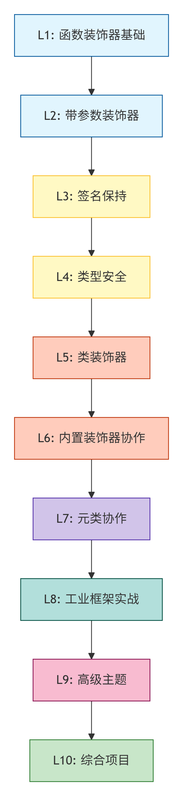

好的，我来为你设计一套循序渐进的 Python 装饰器课程体系。这套课程假设你已有其他语言的编程功底，聚焦 Python 装饰器的**底层机制**与**工业实践**两条主线。

---

## Python 装饰器精通课程大纲

### L1：函数装饰器基础
**核心认知**：装饰器就是 `func = decorator(func)` 的语法糖
- 一级函数对象与高阶函数的自然延伸
- 无参装饰器的"长形式"与 `@` 语法糖的等价转换
- 装饰器的**导入时执行** vs **调用时执行** 的时序差异
- 装饰器链的叠加顺序：从下往上包装，从上往下执行
- 🔧 实践：编写计时器装饰器

> **预期掌握**：能手工写出无参装饰器，解释 `@timer` 等价于什么
>
> **自查题**：一个被 `@deco` 装饰的函数，`deco` 在什么时候被执行？被装饰函数名此时指向什么？

---

### L2：带参数装饰器
**核心认知**：参数化装饰器是"返回装饰器的工厂函数"
- 从两层嵌套到三层嵌套的跃迁
- 闭包变量在工厂函数中的绑定时机
- 带参装饰器的调用等价式：`func = factory(arg)(func)`
- 🔧 实践：编写带重试次数和延迟参数的 `@retry` 装饰器

> **预期掌握**：能独立写出三层嵌套的参数化装饰器，解释每层闭包的生命周期
>
> **自查题**：`@deco(a=1)` 和 `@deco` 在语法上等价于什么？写出完整的手工形式。

---

### L3：签名保持与元数据保护
**核心认知**：装饰器会"污染"函数身份，`wraps` 是解药
- 装饰器如何丢失 `__name__`、`__doc__`、`__module__`、`__annotations__`
- `functools.wraps` 的 `assigned` 与 `updated` 参数精析
- `functools.partial` 与装饰器的差异与组合
- `inspect.signature` 验证签名保真度
- 🔧 实践：编写完全保持签名的日志装饰器

> **预期掌握**：使用 `wraps` 保护函数元数据，能说出 `wraps` 默认拷贝哪 5+ 个属性
>
> **自查题**：写一个装饰器，装饰前后 `inspect.signature` 的输出完全相同，验证之。

---

### L4：类型安全的装饰器
**核心认知**：现代 Python 的类型检查器可以"看穿"正确编写的装饰器
- `TypeVar` 泛型变量绑定返回类型
- `ParamSpec`（Python 3.10+）捕获完整参数签名
- `Concatenate` 在装饰器中"消费"或"添加"参数
- 类型注解对 IDE 自动补全和 mypy/pyright 检查的影响
- 🔧 实践：编写带有完整类型注解的 `@log_call`，IDE 能正确推断被装饰函数的参数类型

> **预期掌握**：使用 `ParamSpec` + `TypeVar` 写出类型透明的装饰器
>
> **自查题**：在 VS Code/PyCharm 中验证：被装饰函数调用时参数提示与原函数一致。

---

### L5：类装饰器
**核心认知**：`__call__` 让实例成为可调用装饰器，`__init__` 承载参数
- 类装饰器的两种形式：无参（类本身）与带参（`__init__` + `__call__`）
- 对比函数装饰器：状态管理更自然，可继承扩展
- 类装饰器与 `@dataclass` 的配合
- 描述符协议冲突：当类装饰器被用于方法时
- 🔧 实践：编写有状态计数器装饰器，记录函数被调用次数

> **预期掌握**：能根据复杂度选择函数装饰器或类装饰器
>
> **自查题**：用类装饰器实现一个支持 `max_calls` 参数、超限抛出异常的限制器。

---

### L6：装饰器与内置装饰器的协作
**核心认知**：装饰器顺序决定语义——放错位置，行为全变
- `@staticmethod`、`@classmethod`、`@property` 的底层描述符机制
- 自定义装饰器与 `@classmethod` 的叠加顺序陷阱
- 为什么 `@classmethod` 应该在**最外层**
- `@property` 装饰器链：getter、setter、deleter
- 🔧 实践：编写同时支持普通函数和 `@classmethod` 的缓存装饰器

> **预期掌握**：能解释为什么 `@cache` 放在 `@classmethod` 上面和下面结果不同
>
> **自查题**：写出 `@deco` `@classmethod` `def f(cls)` 的正确叠加顺序，并解释原因。

---

### L7：装饰器与元类的协作
**核心认知**：元类控制"类的创建"，类装饰器控制"创建后的修改"
- 元类的 `__new__` 和 `__init__` 在装饰器**之前**执行
- 类装饰器 vs 元类：职责边界与选择决策树
- 组合使用：元类设置钩子，装饰器注册类
- 🔧 实践：用元类 + 类装饰器实现自动注册子类的插件系统

> **预期掌握**：能画出类创建全流程时序图，明确装饰器在哪个环节介入
>
> **自查题**：类装饰器能完全替代元类吗？什么场景下必须用元类？

---

### L8：工业级装饰器实战
**核心认知**：框架装饰器的本质——都是上述基础模式的组合
- Flask `@app.route()` 源码精析：参数化 + 注册模式
- FastAPI 依赖注入装饰器的 `inspect` 签名解析
- click 命令行装饰器的栈式设计
- Django `@login_required` 的中间件思维
- 🔧 实践：编写一个简版 Flask 路由系统（20 行核心代码）

> **预期掌握**：能阅读主流框架装饰器源码，理解其设计意图
>
> **自查题**：自己实现一个 `@route('/path', methods=['GET'])` 并能注册和分发请求。

---

### L9：高级主题与性能调优
**核心认知**：装饰器不是银弹，滥用会带来调试灾难
- `wrapt` 库：通用装饰器，正确处理所有调用场景（函数、方法、类方法）
- 异步装饰器：`async def` 与普通函数的统一处理
- 装饰器的性能开销量化（每次调用多一层函数栈）
- 装饰器与 `functools.lru_cache` 的配合与冲突
- 单元测试中"剥除"装饰器的技巧
- 🔧 实践：编写同时支持同步和异步函数的 `@measure_time`

> **预期掌握**：能评估装饰器的性能影响，处理同步/异步统一装饰
>
> **自查题**：写一个装饰器，被装饰函数是 `async def` 时用 `await` 调用，否则直接调用。

---

### L10：综合项目——构建自己的装饰器库
**项目目标**：将所学整合为一个可发布的微型装饰器工具包
- 设计 API：`@retry`、`@log`、`@cache`、`@validate`、`@deprecated`
- 统一错误处理与日志策略
- 完整的类型注解和文档字符串
- 单元测试覆盖
- 打包为 pip 可安装的包

> **预期掌握**：从设计到发布的完整流程，代码可直接用于生产环境
>
> **最终考核**：发布你的装饰器库，用它在项目中替代重复的样板代码。

---

## 课程全景速览

> 蓝 = 基础构建 | 黄 = 类型安全 | 橙 = 类体系 | 紫 = 元编程 | 绿/粉 = 工业实践
